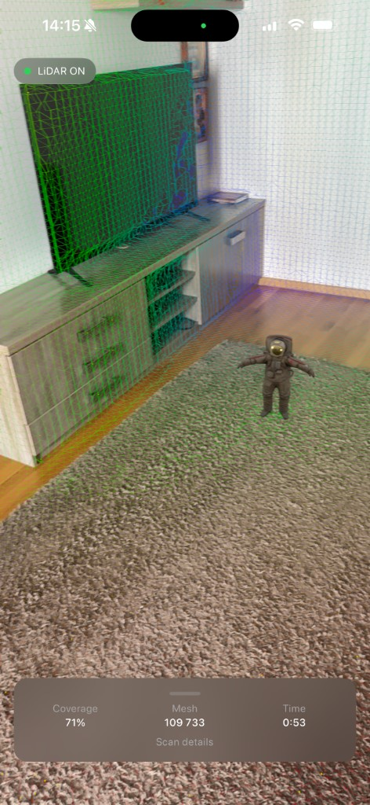
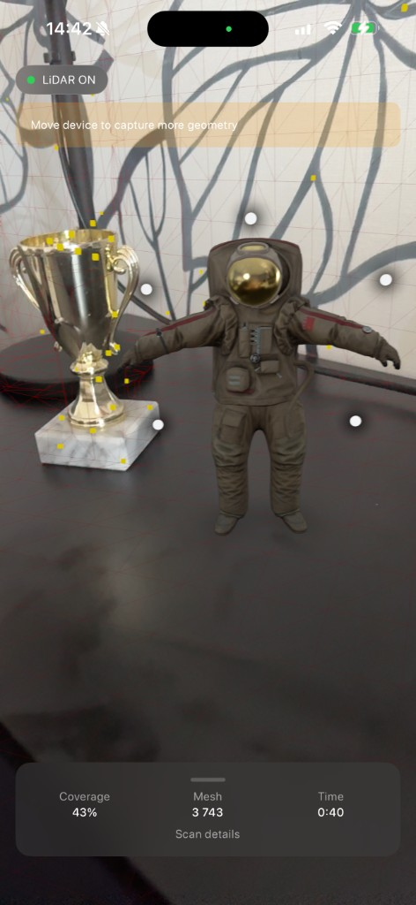

# RoomScanner

LiDAR-only ARKit learning project: tap-to-place a figure with depth-aware occlusion, mesh debug visualization, and silent dev snapshots.

## Screenshots

| LiDAR mesh overlay | Tap-to-place figure |
|:---:|:---:|
|  |  |

Scene-understanding mesh, live coverage metrics, and one-tap placement with occlusion.

## About

RoomScanner requires an iPhone with LiDAR. It captures room geometry in the background, lets you place a figure with one tap (occlusion against real furniture), and saves metric snapshots automatically for developer review.

Debug overlays (feature points and scene-understanding mesh) are always on for learning and demos.

## Requirements

- iOS 18+
- Xcode 16+
- **LiDAR iPhone** (e.g. Pro models with LiDAR scanner)
- **Apple Developer account** to run on a physical device (free or paid program)

The iOS Simulator does not provide LiDAR or a real AR camera feed; use a device for the full experience.

## Getting started

1. Clone the repo and open `RoomScanner.xcodeproj` in Xcode.
2. Select the **RoomScanner** scheme and your LiDAR iPhone as the run destination.
3. In **Signing & Capabilities**, choose your **Team** (Personal Team works with a free Apple ID).
4. Build and run on the device. Allow camera access when prompted.

### Run tests

```bash
xcodebuild -project RoomScanner.xcodeproj -scheme RoomScanner \
  -destination 'platform=iOS Simulator,name=iPhone 17 Pro' test
```

Unit tests run on the simulator; AR placement still requires a LiDAR device.

## Usage

1. Walk around so LiDAR mesh builds (debug overlays show geometry).
2. **Tap the floor** once to place the figure (**one placement per session**).
3. Open **Scan details** (bottom bar) for live metrics and snapshot history.
4. Use **Reset session** in the developer sheet to clear the figure and place again.

Additional taps on the floor or figure are ignored until you reset.

## Debugging

Logs use `os.Logger` with subsystem `com.vil4max.roomscanner`:

| Category | What it logs |
|----------|----------------|
| `ARSession` | Session lifecycle, configuration, tracking changes, anchor adds, interruptions |
| `Metrics` | Throttled scan metrics every 2 seconds while recording |
| `Capture` | Scan UI lifecycle, placement, start/finish, persistence |

Filter in Console.app: `subsystem:com.vil4max.roomscanner`

## Tech stack

- SwiftUI
- ARKit
- RealityKit
- Swift Concurrency (`async`/`await`)
- MVVM + protocol-based dependency injection
- Swift Testing

## Architecture

- **App** — entry point, LiDAR gate, dependency wiring (`AppDependencies`)
- **Features** — `Scan` screen and `ScanHistoryViewModel` (snapshots in developer sheet)
- **Domain** — value types, quality/guidance evaluators, use cases (`FinishScan`, `LoadScanHistory`)
- **Data** — AR session, metrics, persistence, logging
- **DesignSystem** — theme and reusable UI components

Navigation uses `NavigationStack` in the app entry. View models do not own navigation state.

## Project structure

```
RoomScanner/
├── App/
├── DesignSystem/
├── Domain/
│   ├── Evaluators/
│   ├── Models/
│   └── UseCases/
├── Data/
│   ├── Logging/
│   └── Services/
├── Features/
│   ├── Scan/
│   └── History/
└── Resources/

RoomScannerTests/
```

## Third-party assets

- `CosmonautSuit_en.reality` — [Apple AR Quick Look sample](https://developer.apple.com/augmented-reality/quick-look/models/cosmonaut/CosmonautSuit_en.reality). Subject to Apple's sample content terms.

## Bundle ID

Default: `com.vil4max.roomscanner` — change in Xcode if you fork the project.

## License

MIT — see [LICENSE](LICENSE).
