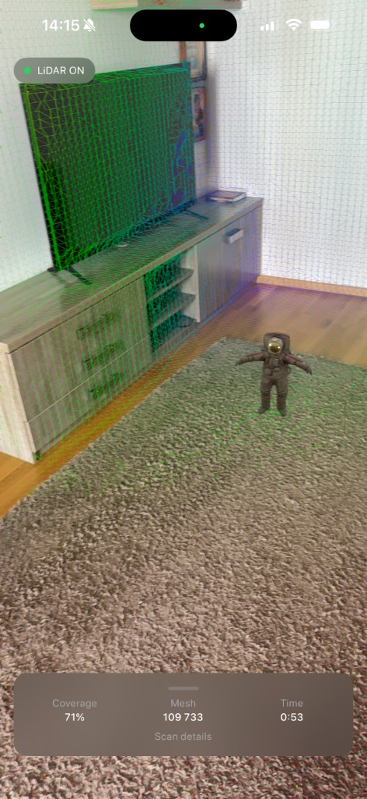
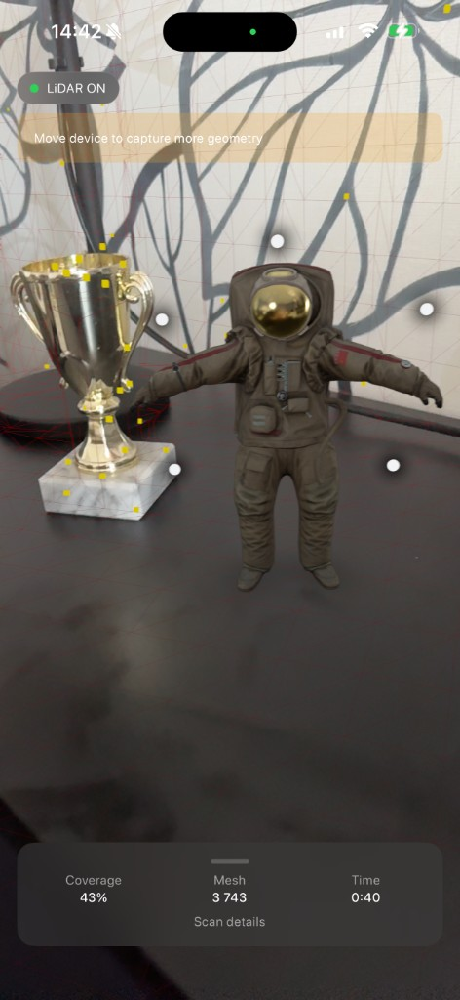

# RoomScanner

Hybrid room capture pet: on-device LiDAR lab plus AI Capture packages processed offline on Mac into a semantic metric mesh you can re-open in Results.

## Stack

iOS 18+ · Xcode 16+ · iPhone 15 Pro (LiDAR) · SwiftUI · ARKit · RealityKit · Swift Concurrency · MVVM · Swift Testing · Python 3.11+ pipeline (MPS) · Apple sample asset (`CosmonautSuit_en.reality`)

## Screenshots

| LiDAR mesh overlay | Tap-to-place figure |
|:---:|:---:|
|  |  |

Scene-understanding mesh, live coverage metrics, and one-tap placement with occlusion.
