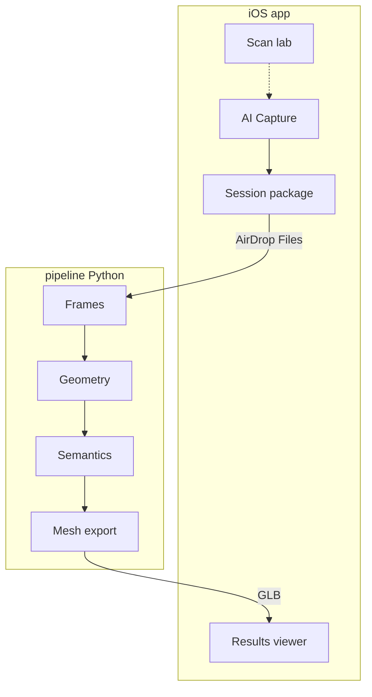

# Architecture

## Product modes

RoomScanner is an active personal pet with three modes in one app:

| Mode | Role |
|------|------|
| **Scan (lab)** | Original ARKit LiDAR mesh + figure placement (unchanged reference) |
| **AI Capture** | Record RGB + ARKit scene depth package for offline foundation-model pipeline |
| **Results** | Import / view semantic GLB (or PLY note) produced on Mac |

Offline AI lives in [`pipeline/`](../pipeline/) — see [`ai-pipeline.md`](ai-pipeline.md).



## Layers

- **App** — `RootTabView`, LiDAR gate for Scan lab, dependency wiring (`AppDependencies`)
- **Features** — `Scan`, `Capture`, `AIResult`, `History` (dev sheet)
- **Domain** — value types, evaluators, use cases; capture metadata models
- **Data** — AR session, metrics, persistence, capture package export, model import
- **DesignSystem** — theme and reusable UI components

Navigation: root `TabView`; feature view models do not own tab selection.

## Project structure

```
RoomScanner/
├── App/
├── DesignSystem/
├── Domain/
│   ├── Evaluators/
│   ├── Models/
│   └── UseCases/
├── Data/
│   ├── Logging/
│   └── Services/
├── Features/
│   ├── Root/
│   ├── Scan/
│   ├── Capture/
│   ├── AIResult/
│   └── History/
└── Resources/

pipeline/                 # Python offline CLI (sibling package)
RoomScannerTests/
docs/
```

## Debugging

Logs use `os.Logger` with subsystem `com.vil4max.roomscanner`:

| Category | What it logs |
|----------|----------------|
| `ARSession` | Session lifecycle, configuration, tracking changes, anchor adds, interruptions |
| `Metrics` | Throttled scan metrics every 2 seconds while recording |
| `Capture` | Scan UI + AI capture package lifecycle |
| `AIPipeline` | Import / Results viewer |

Filter in Console.app: `subsystem:com.vil4max.roomscanner`

## Third-party assets

`CosmonautSuit_en.reality` — [Apple AR Quick Look sample](https://developer.apple.com/augmented-reality/quick-look/models/cosmonaut/CosmonautSuit_en.reality). Subject to Apple's sample content terms.
